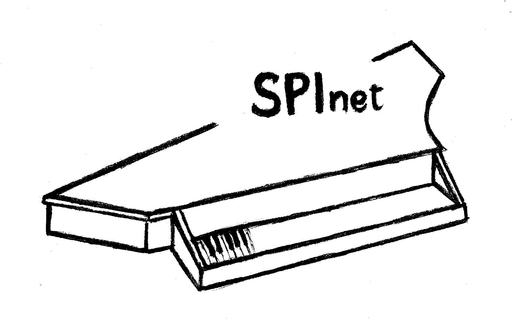
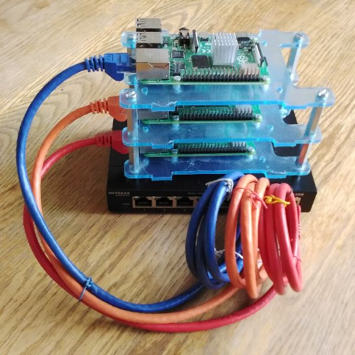
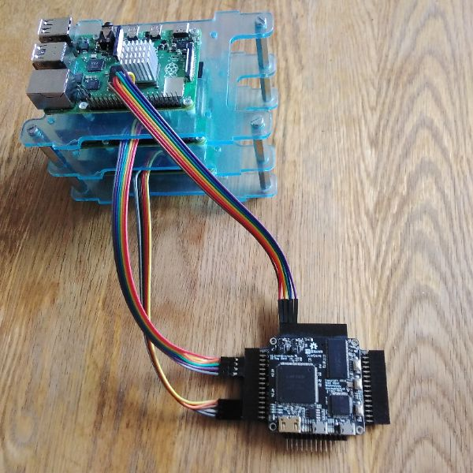
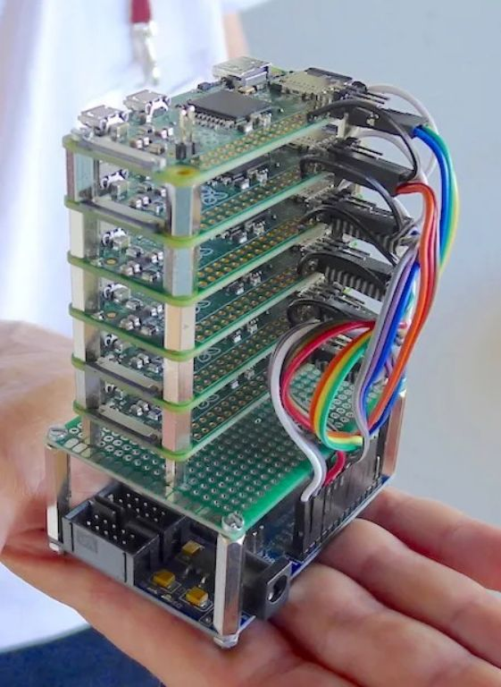
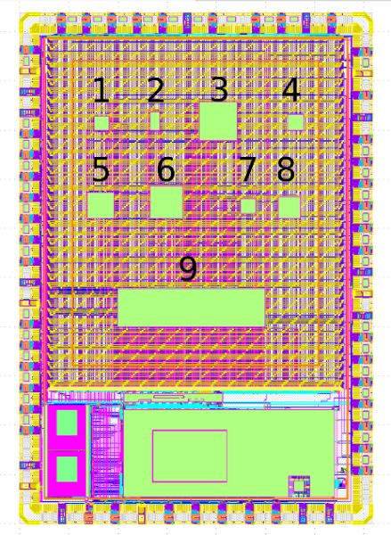

# spinet
Minimalist Network-on-Chip

For background, see https://www.youtube.com/watch?v=bjUphH1a1vc
### Motivation
Using Ethernet to interconnect a Raspberry Pi cluster seems a bit clunky.

Instead, we build a minimalist Network-on-Chip on an ICE40 FPGA, using SPI to interface with the Pi nodes.

We can use SPInet with the Raspberry Pi Zero, which has no built-in Ethernet, to make an extremely compact cluster. Here an Altera Cyclone II FPGA is used for the Network-on-Chip circuit.

Finally the SPInet circuit is implemented on an ASIC (sub-design 6 below) as part of a multi-project chip using the Caravel framework from `efabless.com`

